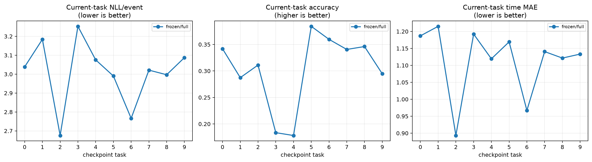
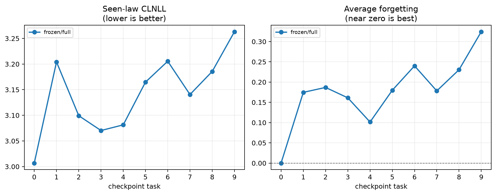
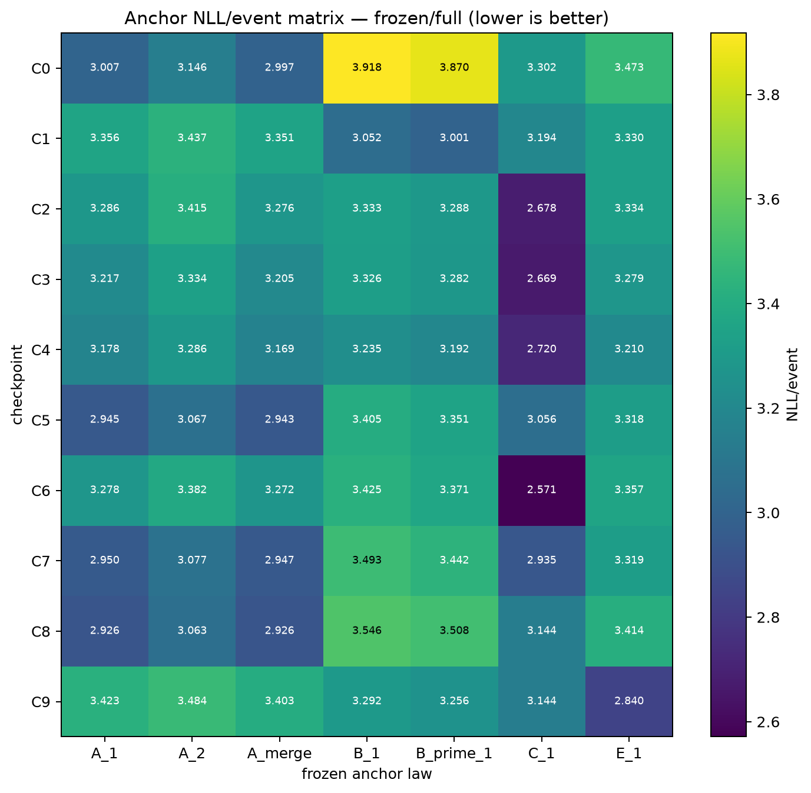
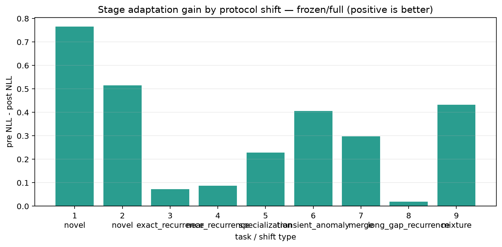
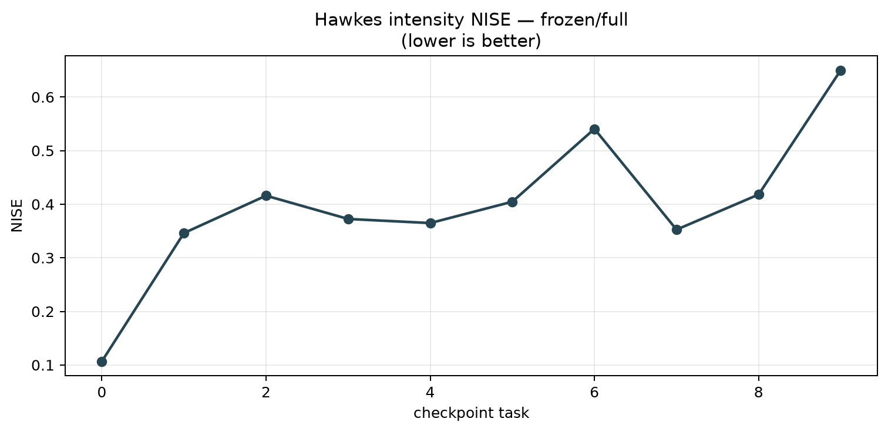
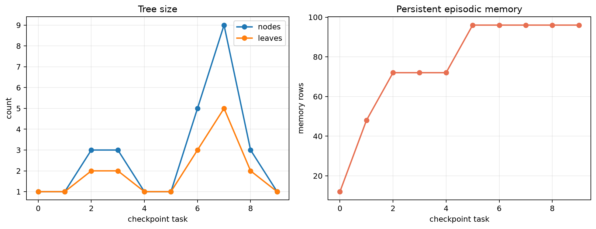
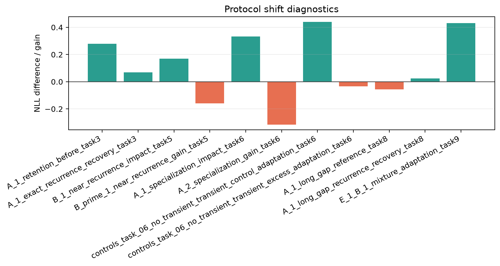

# Hawkes Memory Tree CL Evaluation

- Data root: `/home/xinye/Benchmark/Datasets/CL/hm_continual_v2`
- Benchmark manifest: `/home/xinye/Benchmark/Datasets/CL/hm_continual_v2/benchmark_manifest.json`
- Persistent-law averages follow `persistent_regimes`; diagnostic transient anchors are reported in the OOD section.
- Checkpoints: `/home/xinye/Benchmark/Evaluation/results/continual/HM/full/seed_27/checkpoint`
- Checkpoint tasks: `[0, 1, 2, 3, 4, 5, 6, 7, 8, 9]`
- Variants: `['frozen/full', 'fast_adapt/full', 'online_write/full']`
- Task-test protocol: checkpoint `task_k_best` is evaluated on `D_k^test`; `D_{k+1}^test` is also evaluated before learning when available.
- Frozen anchors: `enabled`.

## Checkpoint topology

| checkpoint | nodes | leaves | max depth | memory rows |
|---:|---:|---:|---:|---:|
| task_00_best | 1 | 1 | 0 | 12 |
| task_01_best | 1 | 1 | 0 | 48 |
| task_02_best | 3 | 2 | 1 | 72 |
| task_03_best | 3 | 2 | 1 | 72 |
| task_04_best | 1 | 1 | 0 | 72 |
| task_05_best | 1 | 1 | 0 | 96 |
| task_06_best | 5 | 3 | 2 | 96 |
| task_07_best | 9 | 5 | 3 | 96 |
| task_08_best | 3 | 2 | 1 | 96 |
| task_09_best | 1 | 1 | 0 | 96 |

## Current-task test quality

| checkpoint | variant | NLL/event | accuracy | time MAE |
|---:|---|---:|---:|---:|
| task_00_best | frozen/full | 3.038727 | 0.3419 | 1.1869 |
| task_00_best | fast_adapt/full | 3.038736 | 0.3404 | 1.1869 |
| task_00_best | online_write/full | 3.038755 | 0.3400 | 1.3583 |
| task_01_best | frozen/full | 3.184145 | 0.2874 | 1.2151 |
| task_01_best | fast_adapt/full | 3.184202 | 0.2869 | 1.2151 |
| task_01_best | online_write/full | 3.184202 | 0.2869 | 1.2937 |
| task_02_best | frozen/full | 2.675600 | 0.3111 | 0.8931 |
| task_02_best | fast_adapt/full | 2.675620 | 0.3122 | 0.8931 |
| task_02_best | online_write/full | 2.675654 | 0.3116 | 0.9378 |
| task_03_best | frozen/full | 3.252926 | 0.1836 | 1.1923 |
| task_03_best | fast_adapt/full | 3.252746 | 0.1841 | 1.1922 |
| task_03_best | online_write/full | 3.252786 | 0.1841 | 1.2299 |
| task_04_best | frozen/full | 3.075784 | 0.1782 | 1.1193 |
| task_04_best | fast_adapt/full | 3.075630 | 0.1787 | 1.1192 |
| task_04_best | online_write/full | 3.075630 | 0.1787 | 1.1825 |
| task_05_best | frozen/full | 2.990111 | 0.3842 | 1.1693 |
| task_05_best | fast_adapt/full | 2.990111 | 0.3842 | 1.1693 |
| task_05_best | online_write/full | 2.990111 | 0.3842 | 1.2744 |
| task_06_best | frozen/full | 2.766434 | 0.3597 | 0.9669 |
| task_06_best | fast_adapt/full | 2.766434 | 0.3597 | 0.9669 |
| task_06_best | online_write/full | 2.766434 | 0.3597 | 1.0426 |
| task_07_best | frozen/full | 3.021333 | 0.3406 | 1.1406 |
| task_07_best | fast_adapt/full | 3.021333 | 0.3406 | 1.1406 |
| task_07_best | online_write/full | 3.021333 | 0.3406 | 1.2598 |
| task_08_best | frozen/full | 2.997011 | 0.3461 | 1.1215 |
| task_08_best | fast_adapt/full | 2.997011 | 0.3461 | 1.1215 |
| task_08_best | online_write/full | 2.997011 | 0.3461 | 1.2045 |
| task_09_best | frozen/full | 3.087388 | 0.2947 | 1.1332 |
| task_09_best | fast_adapt/full | 3.087388 | 0.2947 | 1.1332 |
| task_09_best | online_write/full | 3.087388 | 0.2947 | 1.2195 |

## Continual retention and anchors

CLNLL averages only anchor laws whose first occurrence is no later than the checkpoint. Forgetting is current NLL minus the best NLL since that law was first seen.

| checkpoint | variant | CLNLL | avg forgetting | seen laws |
|---:|---|---:|---:|---:|
| task_00_best | frozen/full | 3.006721 | 0.000000 | 1 |
| task_01_best | frozen/full | 3.204150 | 0.174696 | 2 |
| task_02_best | frozen/full | 3.099223 | 0.186803 | 3 |
| task_03_best | frozen/full | 3.070334 | 0.161179 | 3 |
| task_04_best | frozen/full | 3.081346 | 0.101486 | 4 |
| task_05_best | frozen/full | 3.164746 | 0.179843 | 5 |
| task_06_best | frozen/full | 3.205489 | 0.240083 | 5 |
| task_07_best | frozen/full | 3.140530 | 0.178267 | 6 |
| task_08_best | frozen/full | 3.185601 | 0.230504 | 6 |
| task_09_best | frozen/full | 3.263112 | 0.324395 | 7 |

## Stage-level plasticity

`adaptation_gain_nll = pre_nll - post_nll`; positive means the current task improved after training.

| task | shift type | variant | pre NLL | post NLL | adaptation gain |
|---:|---|---|---:|---:|---:|
| task_00 | initial | frozen/full | NA | 3.038727 | NA |
| task_01 | novel | frozen/full | 3.950129 | 3.184145 | 0.765984 |
| task_02 | novel | frozen/full | 3.190401 | 2.675600 | 0.514801 |
| task_03 | exact_recurrence | frozen/full | 3.325829 | 3.252926 | 0.072903 |
| task_04 | near_recurrence | frozen/full | 3.163710 | 3.075784 | 0.087926 |
| task_05 | specialization | frozen/full | 3.218951 | 2.990111 | 0.228840 |
| task_06 | transient_anomaly | frozen/full | 3.172189 | 2.766434 | 0.405755 |
| task_07 | merge | frozen/full | 3.319357 | 3.021333 | 0.298024 |
| task_08 | long_gap_recurrence | frozen/full | 3.016900 | 2.997011 | 0.019889 |
| task_09 | mixture | frozen/full | 3.519568 | 3.087388 | 0.432181 |

## Transfer and adaptation contract

FWT compares the same task test set from the fixed C_init and the pre-task checkpoint. Only genuinely unseen persistent-law tasks enter the average; recurrence tasks remain diagnostics.

- Average FWT: `0.017803` (available).

| protocol | task | K min | K max | adaptation AUC | status |
|---|---:|---:|---:|---:|---|
| fast_adapt | 1 | 0 | 32 | 0.000039 | available |
| fast_adapt | 2 | 0 | 32 | -0.001926 | available |
| fast_adapt | 3 | 0 | 32 | -0.011404 | available |
| fast_adapt | 4 | 0 | 32 | -0.009446 | available |
| fast_adapt | 5 | 0 | 32 | -0.005264 | available |
| fast_adapt | 6 | 0 | 32 | -0.005341 | available |
| fast_adapt | 7 | 0 | 32 | -0.006095 | available |
| fast_adapt | 8 | 0 | 32 | -0.003217 | available |
| fast_adapt | 9 | 0 | 32 | -0.001193 | available |
| online_write | 1 | 0 | 32 | 0.000045 | available |
| online_write | 2 | 0 | 32 | -0.001926 | available |
| online_write | 3 | 0 | 32 | -0.011369 | available |
| online_write | 4 | 0 | 32 | -0.009453 | available |
| online_write | 5 | 0 | 32 | -0.005264 | available |
| online_write | 6 | 0 | 32 | -0.005341 | available |
| online_write | 7 | 0 | 32 | -0.006095 | available |
| online_write | 8 | 0 | 32 | -0.003217 | available |
| online_write | 9 | 0 | 32 | -0.001193 | available |

| returned law | first task | return task | shift | RRR | status |
|---|---:|---:|---|---:|---|
| A_1 | 0 | 3 | exact_recurrence | NA | not_available_missing_first_gain |
| A_1 | 0 | 8 | long_gap_recurrence | NA | not_available_missing_first_gain |

## HM-specific state

Topology action counts come from committed transaction events; no leaf-count difference is inferred.

| task | nodes | leaves | episodic rows | episodic bytes | semantic bytes | split | merge | prune | NISE |
|---:|---:|---:|---:|---:|---:|---:|---:|---:|---:|
| 0 | 1 | 1 | 12 | 180619 | 1692 | 0 | 0 | 0 | 0.106693 |
| 1 | 1 | 1 | 48 | 498708 | 1692 | 2 | 2 | 0 | 0.346172 |
| 2 | 3 | 2 | 72 | 728796 | 2780 | 3 | 3 | 0 | 0.415918 |
| 3 | 3 | 2 | 72 | 717980 | 2780 | 3 | 4 | 0 | 0.372463 |
| 4 | 1 | 1 | 72 | 729120 | 1692 | 5 | 5 | 1 | 0.364813 |
| 5 | 1 | 1 | 96 | 940208 | 1692 | 6 | 6 | 1 | 0.404633 |
| 6 | 5 | 3 | 96 | 956648 | 3868 | 8 | 6 | 1 | 0.540568 |
| 7 | 9 | 5 | 96 | 972512 | 6044 | 10 | 6 | 1 | 0.352533 |
| 8 | 3 | 2 | 96 | 948332 | 2780 | 10 | 9 | 1 | 0.418080 |
| 9 | 1 | 1 | 96 | 940208 | 1692 | 10 | 9 | 2 | 0.650036 |

## Schedule-driven diagnostics

For NLL differences, positive values mean the right-hand condition has lower NLL; definitions come from task shift_type and paired controls in the protocol.

| metric | formula | value | expected |
|---|---|---:|---|
| A_1_retention_before_task3 | `L_2,A_1 - L_0,A_1` | 0.279223 | near_zero_or_negative |
| A_1_exact_recurrence_recovery_task3 | `L_2,A_1 - L_3,A_1` | 0.069407 | positive |
| B_1_near_recurrence_impact_task5 | `L_5,B_1 - L_4,B_1` | 0.170231 | near_zero_or_negative |
| B_prime_1_near_recurrence_gain_task5 | `L_4,B_prime_1 - L_5,B_prime_1` | -0.158703 | positive |
| A_1_specialization_impact_task6 | `L_6,A_1 - L_5,A_1` | 0.333441 | near_zero_or_negative |
| A_2_specialization_gain_task6 | `L_5,A_2 - L_6,A_2` | -0.315552 | positive |
| controls_task_06_no_transient_transient_control_adaptation_task6 | `L_{5,6}^control - L_{6,6}^control` | 0.439596 | positive |
| controls_task_06_no_transient_transient_excess_adaptation_task6 | `(L_{5,6} - L_{6,6}) - (L_{5,6}^control - L_{6,6}^control)` | -0.033841 | near_zero_or_negative |
| A_1_long_gap_reference_task8 | `L_7,A_1 - L_0,A_1` | -0.056290 | near_zero_or_negative |
| A_1_long_gap_recurrence_recovery_task8 | `L_7,A_1 - L_8,A_1` | 0.024229 | positive |
| E_1_B_1_mixture_adaptation_task9 | `P_9^pre - P_9^post` | 0.432181 | positive |
| A_1_rrr_task3 | `(L_first_pre - L_return_pre) / (L_first_pre - L_first_post)` | NA | not_available_missing_first_gain |
| A_1_rrr_task8 | `(L_first_pre - L_return_pre) / (L_first_pre - L_first_post)` | NA | not_available_missing_first_gain |

## Hawkes law recovery

NISE compares causal total and representative event-type intensity curves against `ground_truth/regimes.npz`.

| checkpoint | variant | regime | NISE | sequences |
|---:|---|---|---:|---:|
| task_00_best | frozen/full | A_1 | 0.106693 | 64 |
| task_01_best | frozen/full | A_1 | 0.638468 | 64 |
| task_01_best | frozen/full | B_1 | 0.053876 | 64 |
| task_02_best | frozen/full | A_1 | 0.553976 | 64 |
| task_02_best | frozen/full | B_1 | 0.482512 | 64 |
| task_02_best | frozen/full | C_1 | 0.211267 | 64 |
| task_03_best | frozen/full | A_1 | 0.447968 | 64 |
| task_03_best | frozen/full | B_1 | 0.456203 | 64 |
| task_03_best | frozen/full | C_1 | 0.213217 | 64 |
| task_04_best | frozen/full | A_1 | 0.406079 | 64 |
| task_04_best | frozen/full | B_1 | 0.363572 | 64 |
| task_04_best | frozen/full | B_prime_1 | 0.383728 | 64 |
| task_04_best | frozen/full | C_1 | 0.305872 | 64 |
| task_05_best | frozen/full | A_1 | 0.028837 | 64 |
| task_05_best | frozen/full | A_2 | 0.024618 | 64 |
| task_05_best | frozen/full | B_1 | 0.607372 | 64 |
| task_05_best | frozen/full | B_prime_1 | 0.639153 | 64 |
| task_05_best | frozen/full | C_1 | 0.723187 | 64 |
| task_06_best | frozen/full | A_1 | 0.637756 | 64 |
| task_06_best | frozen/full | A_2 | 0.652156 | 64 |
| task_06_best | frozen/full | B_1 | 0.677694 | 64 |
| task_06_best | frozen/full | B_prime_1 | 0.670069 | 64 |
| task_06_best | frozen/full | C_1 | 0.065165 | 64 |
| task_07_best | frozen/full | A_1 | 0.037667 | 64 |
| task_07_best | frozen/full | A_2 | 0.040162 | 64 |
| task_07_best | frozen/full | A_merge | 0.037464 | 64 |
| task_07_best | frozen/full | B_1 | 0.678732 | 64 |
| task_07_best | frozen/full | B_prime_1 | 0.709654 | 64 |
| task_07_best | frozen/full | C_1 | 0.611517 | 64 |
| task_08_best | frozen/full | A_1 | 0.009392 | 64 |
| task_08_best | frozen/full | A_2 | 0.026432 | 64 |
| task_08_best | frozen/full | A_merge | 0.013742 | 64 |
| task_08_best | frozen/full | B_1 | 0.779347 | 64 |
| task_08_best | frozen/full | B_prime_1 | 0.816607 | 64 |
| task_08_best | frozen/full | C_1 | 0.862959 | 64 |
| task_09_best | frozen/full | A_1 | 0.864013 | 64 |
| task_09_best | frozen/full | A_2 | 0.862342 | 64 |
| task_09_best | frozen/full | A_merge | 0.878788 | 64 |
| task_09_best | frozen/full | B_1 | 0.506142 | 64 |
| task_09_best | frozen/full | B_prime_1 | 0.541462 | 64 |
| task_09_best | frozen/full | C_1 | 0.819206 | 64 |
| task_09_best | frozen/full | E_1 | 0.078302 | 64 |

## Unseen/OOD novelty control

Transient/unseen anchors are reported separately and never enter CLNLL, average forgetting, or average seen-task NLL.

| checkpoint | variant | regime | NLL/event | accuracy | time MAE |
|---:|---|---|---:|---:|---:|
| task_00_best | frozen/full | B_1 | 3.917837 | 0.0732 | 1.5152 |
| task_00_best | frozen/full | C_1 | 3.301789 | 0.1206 | 1.0553 |
| task_00_best | frozen/full | B_prime_1 | 3.869510 | 0.0784 | 1.5121 |
| task_00_best | frozen/full | A_2 | 3.145748 | 0.3172 | 1.1998 |
| task_00_best | frozen/full | X_transient | 3.184679 | 0.2586 | 1.1197 |
| task_00_best | frozen/full | A_merge | 2.996775 | 0.3369 | 1.1306 |
| task_00_best | frozen/full | E_1 | 3.472801 | 0.1442 | 1.0854 |
| task_01_best | frozen/full | C_1 | 3.194112 | 0.1221 | 0.9494 |
| task_01_best | frozen/full | B_prime_1 | 3.001153 | 0.2720 | 1.1350 |
| task_01_best | frozen/full | A_2 | 3.437453 | 0.1907 | 1.3037 |
| task_01_best | frozen/full | X_transient | 3.376781 | 0.1863 | 1.2064 |
| task_01_best | frozen/full | A_merge | 3.350515 | 0.2090 | 1.2416 |
| task_01_best | frozen/full | E_1 | 3.329552 | 0.1172 | 1.0789 |
| task_02_best | frozen/full | B_prime_1 | 3.287747 | 0.1735 | 1.1600 |
| task_02_best | frozen/full | A_2 | 3.415348 | 0.1549 | 1.1932 |
| task_02_best | frozen/full | X_transient | 3.324363 | 0.1663 | 1.0898 |
| task_02_best | frozen/full | A_merge | 3.276121 | 0.1677 | 1.1265 |
| task_02_best | frozen/full | E_1 | 3.333669 | 0.1591 | 1.0052 |
| task_03_best | frozen/full | B_prime_1 | 3.282312 | 0.1674 | 1.1692 |
| task_03_best | frozen/full | A_2 | 3.334339 | 0.1757 | 1.1918 |
| task_03_best | frozen/full | X_transient | 3.248063 | 0.1754 | 1.0889 |
| task_03_best | frozen/full | A_merge | 3.204780 | 0.1909 | 1.1251 |
| task_03_best | frozen/full | E_1 | 3.279179 | 0.1958 | 1.0081 |
| task_04_best | frozen/full | A_2 | 3.286293 | 0.1787 | 1.2089 |
| task_04_best | frozen/full | X_transient | 3.210206 | 0.1673 | 1.1108 |
| task_04_best | frozen/full | A_merge | 3.168638 | 0.2037 | 1.1398 |
| task_04_best | frozen/full | E_1 | 3.209730 | 0.1995 | 1.0333 |
| task_05_best | frozen/full | X_transient | 3.086937 | 0.3005 | 1.0865 |
| task_05_best | frozen/full | A_merge | 2.943379 | 0.3610 | 1.1082 |
| task_05_best | frozen/full | E_1 | 3.318306 | 0.1008 | 1.0198 |
| task_06_best | frozen/full | X_transient | 3.272965 | 0.1287 | 1.1018 |
| task_06_best | frozen/full | A_merge | 3.271947 | 0.1117 | 1.1327 |
| task_06_best | frozen/full | E_1 | 3.357188 | 0.0871 | 1.0221 |
| task_07_best | frozen/full | X_transient | 3.089542 | 0.2931 | 1.0904 |
| task_07_best | frozen/full | E_1 | 3.318637 | 0.1043 | 1.0273 |
| task_08_best | frozen/full | X_transient | 3.112667 | 0.2946 | 1.0887 |
| task_08_best | frozen/full | E_1 | 3.414354 | 0.1018 | 1.0328 |
| task_09_best | frozen/full | X_transient | 3.374377 | 0.0890 | 1.0577 |

The full per-law anchor table contains `42` rows; see `law_metrics.csv` for start/current/best NLL, forgetting, and BWT.

## Summary plots

### Current Task Quality

### Continual Learning

### Anchor Nll Heatmap

### Stage Adaptation Gain

### Hawkes Law Recovery

### Topology And Memory Growth

### Special Case Metrics

## Output files

- `task_metrics.csv`: checkpoint × task-test × variant metrics.
- `control_metrics.csv`: checkpoint × manifest-declared matched-control metrics.
- `anchor_metrics.csv`: checkpoint × frozen-anchor × variant metrics.
- `continual_summary.csv`: current quality, CLNLL, forgetting, and checkpoint topology.
- `law_metrics.csv`: per-law CLNLL support, forgetting, and BWT terms.
- `stage_metrics.csv`: pre/post task-test adaptation gains.
- `fwt_metrics.csv`: protocol-scoped forward transfer with fixed scratch baseline when supplied.
- `adaptation_points.csv` / `adaptation_summary.csv`: fixed-query K-indexed adaptation curves and normalized AUC.
- `rrr_metrics.csv`: protocol-driven exact/long-gap recurrence retention ratios.
- `hm_state.csv`: HM-only memory, topology transaction counts, and NISE.
- `cl_metrics.json`: canonical CL metric contract shared with baseline runners.
- `anchor_nll_matrix.csv`: paper-style wide checkpoint × regime NLL matrix.
- `special_case_metrics.csv`: schedule-driven recurrence, near-recurrence, specialization, mixture, and transient diagnostics.
- `intensity_metrics.csv` / `intensity_summary.csv`: causal intensity-curve NISE and checkpoint summaries.
- `ood_metrics.csv`: transient/unseen-anchor novelty control, excluded from CL averages.
- `intensity_curves/`: optional total-plus-representative-type GT/prediction plots.
- `plots/`: current quality, CLNLL/forgetting, anchor heatmap, adaptation, NISE, and topology figures.
- `checkpoint_tree.csv`: leaf/node counts and checkpoint memory sizes.
- `summary.json`: machine-readable copy of the complete evaluation manifest.
- `event_predictions.csv`: optional rows selected by `--event-prediction-scope` (default `none`; legacy `--save-event-predictions` means `all`).
- `protocol_comparison.csv`: one comparison table across the selected protocols.
- `frozen/`: strict frozen anchor matrix, CLNLL, forgetting, BWT, and law metrics.
- `fast_adapt/`: official fixed-query adaptation curve plus event-exposure diagnostics; it is excluded from CL aggregates.
- `online_write/`: independent fixed-query write curve plus event-exposure diagnostics; each eval set starts from a fresh checkpoint load.
